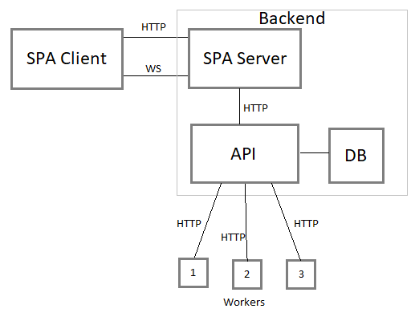

# Application for presenting VRP solutions

Aplikacja pozwala użytkownikom porównywać wyniki rozwiązania problemu VRP (Vehicle Routing Problem),
pochodzące z różnych źródeł. Użytkownik za pomocą interfejsu użytkownika tworzy instancje problemu
wprowadzając potrzebne dane, dane te są przesyłane do backendu za pomocą mechanizmu WebSocket. Na
backendzie problem jest zapisywany w bazie danych i rozsyłany za pomocą protokołu HTTP do
poszczególych workerów, które odsyłają rozwiązanie. Rozwiązanie jest zapisywane w bazie danych a
następnie odysłane i wyświetlane użytkownikowi.

## Wymagania funkcjonalne

### 1. Użytkownik chce dodać nowy punkt na mapie

Aby dodać nowy punkt na mapie, użytkownik najpierw klika przycisk dodawania punktów (niebieskie
kółko z plusikiem), zmieniając jego stan na „włączony”. Gdy przycisk ten jest aktywny, każde
kliknięcie na mapie spowoduje dodanie nowego punktu, będącego częścią wyznaczanych tras

### 2. Użytkownik chce wybrać jeden z dodanych punktów

Użytkownik może wybrać jeden z dodanych punktów na dwa sposoby. Pierwszym z nich jest kliknięcie na
znacznik punktu na mapie, gdy przycisk dodawania nowych punktów jest w stanie „wyłączonym”. Drugim
sposobem jest kliknięcie na selektor punktu w liście wszystkich punktów.Wybranie punktu powoduje
zmianę koloru znacznika danego punktu na mapie, podświetlenie opisu punktu na liście wszystkich
punktów oraz aktywowanie formularza edycji punktu.

### 3. Użytkownik chce edytować punkt na mapie

Gdy użytkownik wybierze jeden z punktów (prze mapę lub listę punktów), odblokowuje się przed nim
możliwość edycji danych tego punktu przez formularz edycji. Zmiany wprowadzone w parametrach punktu
użytkownik musi potwierdzić kliknięciem przycisku „edycji”. Użytkownik ma też możliwość usunięcia
danego punktu przez kliknięcie przycisku „usunięcia”

### 4. Użytkownik uruchamia wyznaczenie tras

Aby wyznaczyć trasy przejazdów, użytkownik musi wprowadzić co najmniej jeden punkt przesyłki oraz
bazę dostaw. Gdy warunki te są spełnione, przycisk wyznaczania trasy zostaje aktywowany i użytkownik
może go kliknąć. Kliknięcie tego guzika odblokuje sekcjępodsumowania, gdzie użytkownik będzie mógł
przejrzeć porównanie różnych algorytmów wyznaczania tras dla danego zbioru punktów.

### 5. Użytkownik chce wybrać, które sposoby routowania pokazać na mapie

Użytkownik ma możliwość, by zaznaczyć w tabeli podsumowania, które trasy (trasy z których
algorytmów), mają być wyświetlone na mapie. By to zrobić, musi kliknąć w pole wyboru w odpowiedniej
kolumnie (ostatnia kolumna tabeli „wyświetlanie”). Jeśli pole jest zaznaczone, trasa zostanie
przedstawiona na mapie, jeśli nie, trasa z danego algorytmu wyświetlona nie będzie.

### 6. Użytkownik chce się zalogować

Aby użytkownik mógł się zalogować, musi się najpierw zarejestrować na witrynie. Jeśli jest
zarejestrowany, to by się zalogować, wystarczy, by przeszedł do strony logowania i podał tam swój
login oraz hasło.

### 7. Użytkownik chce się zarejestrować

W celu rejestracji, użytkownik musi przejść do strony rejestracji.
Wypełnia tam krótki formularz (adres mailowy, nazwa użytkownika, hasło, potwierdzenie hasła,
lokalizacja) oraz klika przycisk „zarejestruj”.

### 8. Użytkownik chce przejrzeć historię wyszukiwać tras

Aby użytkownik mógł przejrzeć historię swoich wyszukiwać musi się wpierw zalogować.
Zalogowany użytkownik ma możliwość przejścia do zakładki „historia”, gdzie znajdują się wypisane
wcześniejsze wyszukiwania (zawierają datę i krótkie podsumowanie, jak liczba punktów na mapie,
lokalizacja bazy).

### 9. Użytkownik chce przywrócić poprzednie wyszukiwanie

Zalogowany użytkownik mamożliwość przywrócenia wcześniejszego wyszukiwania. Gdy znajduje się w
zakładce „historia”, może kliknąć przycisk „Przywróć” we wskazanym wpisie z historii. Spowoduje to
przeniesienie do strony głównej i wypełnienie mapy trasowania danymi ze wskazanego zapytania.

### 10. Administrator chce zobaczyć podsumowanie użytkowników

W celu obejrzenia podsumowania użytkowników korzystających z portalu, administrator musi się wpierw
zalogować, by zweryfikować jego uprawnienia. Po wykonaniu tej czynności, administrator może przejść
na stronę panelu administratora, w której ma możliwość przejrzeć dane lokalizacji użyć witryny. Dane
te przedstawione są zarówno w formie tabelarycznej, jak i zaznaczone są na mapie. W zależności od
stopnia przybliżenia mapy, dane logować przeliczane są dla różnej ziarnistości. Dla przykładu, gdy
przybliżenie mapy wskazuje całą mapę, widać liczbę logować z różnych kontynentów.

## Wymagania techniczne

### Składowanie danych

Dane użytkowników są zapisywane w bazie danych (Postgres).

### Workery

Dla każdej implementacji rozwiązania problemu VRP jest oddzielny worker, który czeka na request ze
strony serwera, a następnie rozwiązuje problem na podstawie otrzymanych danych. Backend czeka na
odpowiedzi od workerów i asynchronicznie wysyła do klienta rozwiązania za pomocą WebSocket.

### Serwer

API przyjmujące dane od klientów i komunikujące się z workerami za pomocą protokołu HTTP i
uaktualniające dane użytkowników w bazie. Zbierane są dane o lokalizacji użytkowników.

## Architektura



### Frontend

Aplikacja SPA (Single Page Application) zbudowana za pomocą React Framework. Połączenie z serwerem
głównym realizowane jest za pomocą WebSocket, instancje problemu są wysyłane w formacie JSON.

### Backend

Aplikacja webowa ASP.NET Core 3.1 komunikująca się z aplikacją frontendową za pomocą mechanizmu
WebSocket. Aplikacja wysyła żądania rozwiązania problemu do poszczególych workerów za pomocą
protokołu HTTP, przy pomocy klasy "WorkerService". Aplikacja łączy się z bazą danych Postgres przy
pomocy framework'a Entity Framework. Kontekst danych znajduje się w klasie "WebApiContext".

### Współpraca z workerami

Klasa WorkerService wysyła na endpoint danego workera request protokułu HTTP zawierający instancję
problemu do rozwiązania i oczekuje odpowiedzi w formacie JSON. Aby dodać nową instancję workera,
którą aplikacja może obsługiwać należy wprowadzić jej dane do bazy danych tak aby serwer miał dostęp
 do endpoitu oraz skonfigurować workera tak żeby mógł przyjmować requesty z danymi od serwera
 niezależnie od implementacji.

Model danych wysyłany do workera:
```
{
  "Id" : [int],
  "VehicleCount" : [int],
  "Points" : [MultiPoint],
  "Base" : [Point]
}
```

Model danych zwracany przez workera:
```
{
  "Id" : [int],
  "Routes" : [MultiLineString],
  "ComputationTime" : [double],
  "CombinedLength" : [double],
  "LongestRouteLongth" : [double],
  "LongestRouteTime" : [double],
  "NumberOfRoutes" : [int],
  "WorkerId" : [int],
  "Worker" : [Worker],
  "CaseId" : [int]
}
```

### Baza danych

Dane są składowane w bazie danych Postgres z rozszerzeniem Postgis umożliwiającym zapisywanie danych
geograficznych. Baza danych składa się z następujących tabel:

- ApplicationUser - użytkownicy aplikacji
- Cases - zawierającą problemy VRP wprowadzone przez użytkowników
- Results - zawierającej wyniki określonych problemów
- Workers - zawierającej znane instancje workerów rozwiązujących problem VPR

## Instrukcja wdrożenia

Instalacja oprogramowania składa się z dwóch części – instalacji aplikacji webowej oraz aplikacji
bazodanowej.

### 1. Instalacja aplikacji webowej

1. Rozpakowujemy archiwum z plikami do wybranego katalogu
2. Uruchamiany wiersz poleceń i przechodzimy do wybranego wcześniej katalogu
3. Wpisujemy w wierszu poleceń poniższy kod i uruchamiany klikając „Enter” serve build
4. Aplikacja webowa gotowa jest do użycia pod adresem wskazanym w wierszu poleceń

Do instalacji aplikacji webowej wymagane są:

- [Node.js](https://nodejs.org) - w wersji 6.12 lub wyższej
- [serve](https://www.npmjs.com/package/serve) – w wersji 11.0.0 lub wyższej

Pozostałe pakiety dostarczane są wraz z aplikacją.

### 2. Instalacja aplikacji serwerowej

Do instalacji wymagany jest framework
[ASP.NET Core 3.1](https://dotnet.microsoft.com/download/dotnet-core/3.1)

Należy mieć dostęp do instancji serwera Postgres z rozszerzeniem PostGIS i w pliku
`appsettings.json` dodać odpowiedni klucz dostępu (ustawić connection string). Następnie należy
uruchomić polecenie:

```bash
dotnet ef database update
```

Uruchomienie aplikacji serwerowej wykonuje się za pomocą polecenia:

```bash
dotnet run
```

Powyższe polecenia należy wykonać w folderze zawierającym pliki wykonalne aplikacji.

### 3. Instrukcja kreacji workera

1. Zainstalować [dockera](https://www.docker.com/).

2. Zainstalować OSM Backend: (Help: https://hub.docker.com/r/osrm/osrm-backend/)

```bash
wget http://download.geofabrik.de/europe/poland/mazowieckie-latest.osm.pbf
docker run -t -v "${PWD}:/data" osrm/osrm-backend osrm-extract -p /opt/car.lua /data/mazowieckie-latest.osm.pbf
docker run -t -v "${PWD}:/data" osrm/osrm-backend osrm-partition /data/mazowieckie-latest.osrm
docker run -t -v "${PWD}:/data" osrm/osrm-backend osrm-customize /data/mazowieckie-latest.osrm
docker run -t -i -p 5010:5000 -v "${PWD}:/data" osrm/osrm-backend osrm-routed /data/mazowieckie-latest.osrm
```

3. Zainstalować pyenv (instalacja i konfiguracja .bashrc) https://realpython.com/intro-to-pyenv/

4. Zainstalować Pythona 3.7.6:

```bash
pyenv install 3.7.6
```

4. W katalogu z workerem zmienić ewentualnie parametry w `settings.json`.

5. W katalogu z workerem wykonać:

```bash
pyenv virtualenv 3.7.6 <nazwa_srodowiska>
pyenv local <nazwa_srodowiska>
pip install -r requirements.txt
python worker.py
```

## Instrukcja użytkownika

1. Użytkownik korzystający z aplikacji po raz pierwszy zakłada konto korzystając z zakładki
"Register", następnie może zalogować się do aplikacji za pomocą zakładki "Login". Zalogowany
użytkownik może wyświetlać historię wprowadzonych przez siebie problemów i ich rozwiązań.

2. Aby stworzyć instancję problemu należy nanieść na mapie punkty będące przystankami w problemie
VRP. Punkty dodawane są poprzez kliknięcie na mapę, dodane punkty wyświetlane są na mapie w postaci
znaczników w kolorze niebieskim i w postaci listy po prawej stronie panelu użytkownika. Z poziomu
listy możliwa jest edycja lub usunięcie wybranego punktu.

3. Za pomocą przycisku "Select depo" użytkownik może wybrać bazę w problemie VRP. Po kliknięciu na
mapę baza wyświetlana jest w postaci białego znacznika.

4. Wysłanie kompletnego problemu realizowane jest przez wciśnięcie przycisku "Send". Rozwiązania
problemu wyświetlane są poniżej mapy.

## Wnioski

Implementacja workerów w języku python ułatwiła nam pracę ze względu na to, że nie jest to język
silnie typowany. Programowanie współbieżne przysporzyło nam dużo problemów.
